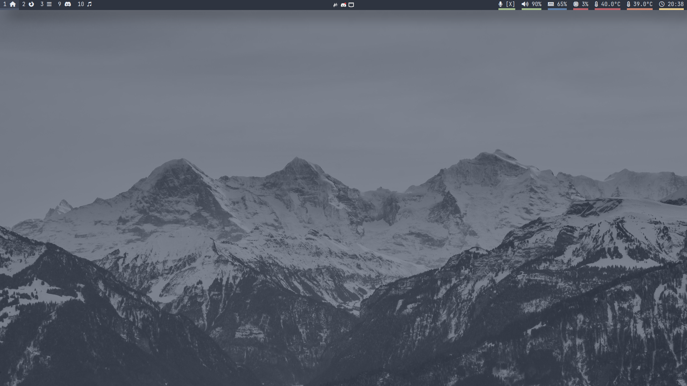
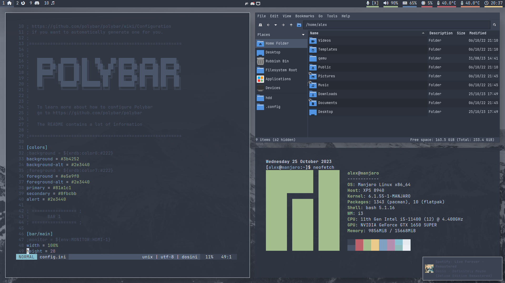

# dotfiles-manjaro
Configurations for my nord-themed i3 desktop

## Screenshots



## Dependencies
```
i3
polybar
picom
rofi
ttf-font-awesome (in nerd-fonts)
ttf-noto-nerd (in nerd-fonts)
noto-fonts-emoji
```

## Additional info
Wallpaper from https://github.com/linuxdotexe/nordic-wallpapers (nordic-wallpapers in the AUR)

Color codes from https://www.nordtheme.com/
