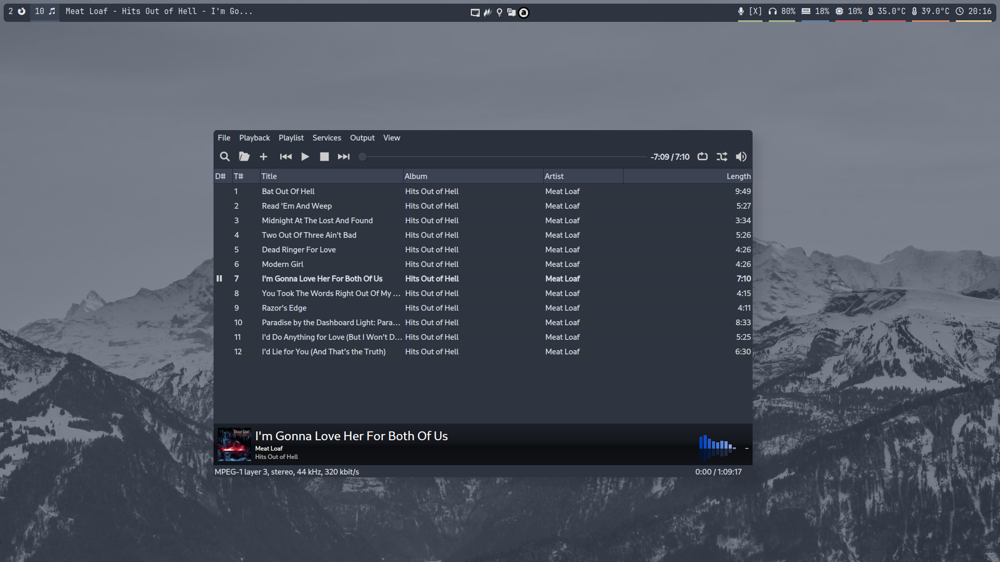

# dotfiles-manjaro
i3 with nord

## Notes
If you do not use an NVIDIA GPU, the GPU module will throw a bunch of errors, so remove ```gpu-temp``` from ```.config/polybar/config.ini``` in the ```modules-right``` section

i3 has some autostarts that you may not want. Just remove the relevent ```exec``` lines at the bottom of ```.config/i3/config```

If you do not want to use focus dimming/transparency, use ```picom_trad``` from ```.config/picom``` and rename it ```picom.conf```

## Dependencies
The following are suggested in the config:
```
i3
i3lock
polybar
picom
rofi
dunst
alacritty
thunar
ttf-jetbrains-mono
ttf-font-awesome
ttf-noto-nerd
noto-fonts-emoji
lxsession-gtk3
lxappearance-gtk3
qt5ct
pavucontrol
nitrogen
```
Optional/Situational:
```
matray
vim
flameshot
qt6ct
nvidia-smi
```

## Keybinds

### Applications
| Key combination | Function |
| -------- | ------- |
| Super+Return | Open terminal window |
| Super+Backslash | Open file manager|
| Super+d | Open launch menu |
| Super+s | Open window menu |
| Super+Shift+p | Open power menu |
| Super+PrntScrn | Screenshot (flameshot) |
| Super+Shift+x | Lock screen |

### Window management
| Key combination | Function |
| -------- | ------- |
| Super+[1-0] | Switch to workspace |
| Super+[h,j,k,l] | Shift window focus |
| Super+Shift+[h,j,k,l] | Change Window size |
| Super+v | Next window vertical |
| Super+b | Next window horizontal |
| Super+Shift+q | Kill focused window |
| Super+Shift+r | Reload i3 |


## Additional info
Wallpaper from https://github.com/linuxdotexe/nordic-wallpapers (nordic-wallpapers in the AUR)

Color codes from https://www.nordtheme.com/

## Gallery




